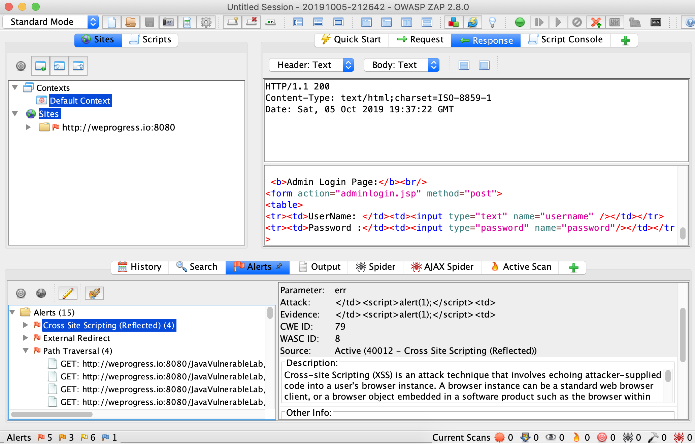

# OWASP Zap Tool

The Open Web Application Security Project (OWASP) provides a security tool, called `Zed Attack Proxy` (**ZAP**) to scan the vulnerabilities.
OWASP ZAP is one of the most popular security tools and is actively maintained. It comes with a UI and it allows to launch an automated scan against a URL of a web application - for example [http://localhost:8080/JavaVulnerableLab](http://localhost:8080/JavaVulnerableLab).

You may download it [here](https://www.owasp.org/index.php/OWASP_Zed_Attack_Proxy_Project).

But in the software industry, we may want to automate to this inside the Continuous Integration and Continuous Delivery (**CI/CD**) toolchain. Generally, SonarQube is used to gather metrics related to the software quality and vulnerabilities. 

Here, we can use a[ ZAP Plugin](https://github.com/Coveros/zap-sonar-plugin) for SonarQube 7.x to do just that. If you are interested in doing so, please refer to [this guideline](sonarqube.md).

