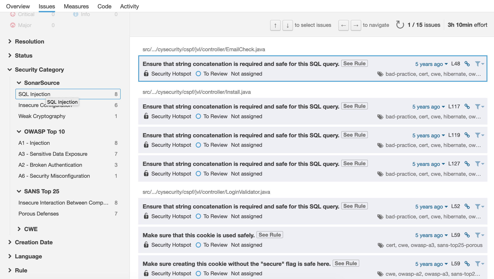

## Add configuration

We need to add sonar configuration for the project to let mvn scan it.

```sh
echo "
sonar.projectKey=org.cysecurity:JavaVulnerableLab
sonar.projectName=pJavaVulnerableLab
sonar.projectVersion=0.0.1-SNAPSHOT
sonar.sources=src/main/java
sonar.sourceEncoding=UTF-8
sonar.binaries=target/classes
sonar.java.binaries=target/classes
sonar.tests=src/test/java
sonar.scm.provider=git

#Java report only
sonar.language=java

sonar.zaproxy.reportPath=${WORKSPACE}/zaproxy-report.xml
" > ./sonar-project.properties
```

The line below indicates to the Maven Sonar plugin to use the ZAP-Proxy plugin when do a scan in the project codebase : 

```
sonar.zaproxy.reportPath=${WORKSPACE}/zaproxy-report.xml
```

## ZAP Sonar plugin

We can use a plugin that has been developed by Gene Gotimer ([zap-sonar-plugin](https://github.com/Coveros/zap-sonar-plugin)). And for information, as per the time this is being tested, that plugin requires SonarQube 7.9.

## SonarQube instance

In order to be able to scan the code for vulnerabilities as well as for code qualimetry (coverage, duplication...), we need a running instance of SonarQube. Here we are using Docker to provide that instance, and by the way we do have to create a Dockerfile adding the Zap-Proxy plugin jar on top of SonarQube docker image `sonarqube:lts`. The Current LTS version is 7.9.

## Run a scan

Run this command to analyse the codebase :

```sh
mvn sonar:sonar
```

It connected to the SonarQube server to retrieve informations, such as rules and plugins to apply while scanning the code.

## Quality Metrics

Once this is done, we can see the metrics on SonarQube [Dashboard](http://127.0.0.1:9000/project/issues?id=org.cysecurity%3AJavaVulnerableLab&resolved=false&sonarsourceSecurity=sql-injection&types=SECURITY_HOTSPOT)

